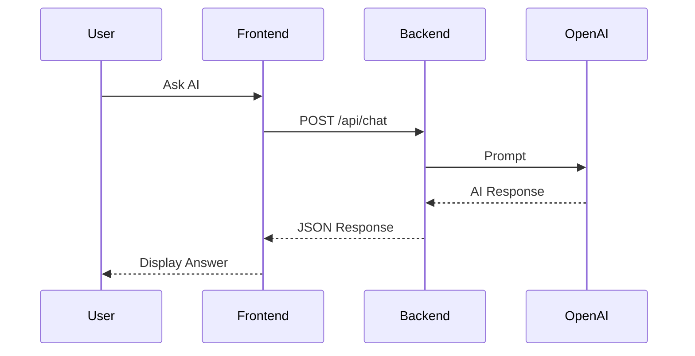

# 🤖 Smart AI Agent

> AI-powered E-commerce Platform built with **React**, **Node.js**, **MongoDB**, **Socket.IO**, **Docker** and **OpenAI API**.


---

# 📸 Demo

> Thêm ảnh chụp màn hình của dự án tại thư mục `docs/images`

## Home Page


---

## AI Assistant


---

## Shopping Cart


---

## Order Management


---

# 📖 Table of Contents

- Overview
- Features
- Tech Stack
- System Architecture
- AI Workflow
- Project Structure
- Database
- Installation
- Docker Deployment
- Local Development
- Environment Variables
- API
- Socket.IO
- Security
- Roadmap
- Troubleshooting
- Contributing
- Author
- License

---

# 📌 Overview

Smart AI Agent là hệ thống thương mại điện tử tích hợp AI hỗ trợ tư vấn và chăm sóc khách hàng.

Repository bao gồm hai phần:

- **Backend API**
- **Frontend Web**

Hệ thống hỗ trợ:

- Đăng nhập JWT
- Google OAuth
- Quản lý sản phẩm
- Giỏ hàng
- Wishlist
- Đơn hàng
- Promotion
- Complaint
- AI Chat
- Realtime Notification
- Docker Deployment

---

# ✨ Features

## Authentication

- ✅ JWT Authentication
- ✅ Refresh Token
- ✅ Google Login
- ✅ Forgot Password
- ✅ Account Lock Protection

---

## AI

- ✅ OpenAI Integration
- ✅ AI Chat Assistant
- ✅ Conversation History
- ✅ Intent Classification
- ✅ Product Recommendation

---

## E-commerce

- ✅ Product Management

- ✅ Shopping Cart

- ✅ Wishlist

- ✅ Reviews

- ✅ Orders

- ✅ Promotions

- ✅ Stores

- ✅ Address Management

---

## Realtime

- ✅ Socket.IO

- ✅ Live Notification

---

## Infrastructure

- ✅ Docker

- ✅ Docker Compose

- ✅ Environment Configuration

---

# 🛠 Tech Stack

| Backend   | Frontend   | Database      | AI            | DevOps         |
| --------- | ---------- | ------------- | ------------- | -------------- |
| Node.js   | React      | MongoDB       | OpenAI GPT-4o | Docker         |
| Express   | TypeScript | Mongoose      | OpenAI API    | Docker Compose |
| Socket.IO | Vite       | MongoDB Atlas |               | Git            |

---

# 🏗️ System Architecture

```text
                +----------------------+
                |      Web Browser     |
                +----------+-----------+
                           |
                  HTTP / Socket.IO
                           |
          +----------------+----------------+
          |                                 |
          |        React + TypeScript       |
          +----------------+----------------+
                           |
                     REST API Request
                           |
                 Express + Node.js Server
                           |
        +---------+--------+---------+
        |         |                  |
    MongoDB   OpenAI API       Socket.IO
```

---

# 🤖 AI Workflow



---

# 🗂 Project Structure

```text
.
├── Smart_AI_backend
│   ├── configs
│   ├── controllers
│   ├── middlewares
│   ├── models
│   ├── routes
│   ├── services
│   ├── socket
│   ├── uploads
│   ├── utils
│   ├── package.json
│   └── index.js
│
├── Smart_AI_frontend
│   ├── public
│   ├── src
│   ├── package.json
│   └── vite.config.ts
│
├── docker-compose.yml
├── README.md
└── LICENSE
```

---

# 🗄 Database Collections

MongoDB gồm các collection chính:

- Users
- Products
- Categories
- Orders
- OrderDetails
- Reviews
- Wishlist
- Cart
- Conversations
- Promotions
- Complaints
- Stores
- Appointments
- Addresses

---

# ⚙️ Requirements

- Node.js >= 18

- npm >= 9

- MongoDB >= 7

- Docker Desktop

---

# 🚀 Quick Start (Docker)

## Clone project

```bash
git clone git@github.com:VanDuyKhanh2004/Smart_AI.git

cd Smart_AI
```

---

## Backend

```bash
cd Smart_AI_backend

cp .env.docker.example .env.docker
```

Cập nhật

```
OPENAI_API_KEY

JWT_SECRET

JWT_REFRESH_SECRET
```

---

## Run

```bash
docker compose up --build
```

Sau khi chạy:

Frontend

```
http://localhost:3000
```

Backend

```
http://localhost:5000
```

MongoDB

```
localhost:27017
```

---

# 💻 Local Development

## Backend

```bash
cd Smart_AI_backend

npm install

npm run dev
```

---

## Frontend

```bash
cd Smart_AI_frontend

npm install

npm run dev
```

Frontend

```
http://localhost:5173
```

Backend

```
http://localhost:5000
```

---

# 🔐 Environment Variables

## Backend

```env
PORT=5000

NODE_ENV=development

MONGO_CONNECTION_STRING=

OPENAI_API_KEY=

OPENAI_MODEL=gpt-4o

JWT_SECRET=

JWT_REFRESH_SECRET=

GOOGLE_CLIENT_ID=

SMTP_HOST=

SMTP_PORT=

SMTP_USER=

SMTP_PASS=
```

---

## Frontend

```env
VITE_API_BASE_URL=http://localhost:5000/api

VITE_API_URL=http://localhost:5000

VITE_GOOGLE_CLIENT_ID=
```

---

# 📡 REST API

| Method | Endpoint           | Description    |
| ------ | ------------------ | -------------- |
| POST   | /api/auth/login    | Login          |
| POST   | /api/auth/register | Register       |
| POST   | /api/auth/google   | Google Login   |
| GET    | /api/products      | Get Products   |
| GET    | /api/products/:id  | Product Detail |
| POST   | /api/cart          | Add To Cart    |
| GET    | /api/orders        | Order History  |
| POST   | /api/reviews       | Review Product |
| POST   | /api/chat          | AI Chat        |

---

# ⚡ Socket.IO

Realtime events:

- Order Notification

- AI Streaming

- Live Chat

- User Connection

---

# 🔒 Security

- JWT Authentication

- Password Hashing (bcrypt)

- Google OAuth

- Login Rate Limiting

- Account Lock Protection

- Environment Variables

- CORS Protection

---

# 📈 Performance

- MongoDB Index

- Lazy Loading

- React Query Cache

- Zustand State Management

- Socket.IO Realtime

---

# 🧪 Testing

Hiện tại dự án hỗ trợ:

- Manual Testing

- Intent Classification Evaluation

Trong tương lai:

- Unit Test

- Integration Test

- End-to-End Test

---

# 🚧 Roadmap

## Completed

- ✅ Authentication

- ✅ Google Login

- ✅ Shopping Cart

- ✅ Wishlist

- ✅ Promotion

- ✅ Complaint

- ✅ AI Chat

- ✅ Docker

---

## In Progress

- 🚧 Unit Testing

- 🚧 API Documentation

- 🚧 CI/CD

---

## Future

- Redis Cache

- Kubernetes

- Elasticsearch

- Recommendation Engine

- Microservice Architecture

---

# ❗ Troubleshooting

## MongoDB Connection Error

Kiểm tra:

- MongoDB đang chạy

- Chuỗi kết nối đúng

---

## Google Login

Kiểm tra:

- GOOGLE_CLIENT_ID

- OAuth Redirect URI

---

## AI không phản hồi

Kiểm tra:

- OPENAI_API_KEY

- Internet

---

## Docker Build Error

Thử:

```bash
docker compose down

docker compose up --build
```

---

# 🤝 Contributing

1. Fork repository

2. Tạo branch mới

```bash
git checkout -b feature/your-feature
```

3. Commit

```bash
git commit -m "Add new feature"
```

4. Push

```bash
git push origin feature/your-feature
```

5. Tạo Pull Request

---

# 👨‍💻 Author

**Văn Duy Khánh**

GitHub

https://github.com/VanDuyKhanh2004

Email

duykhanhpro04@gmail.com

---

# 🙏 Acknowledgements

Dự án sử dụng:

- React

- Express

- MongoDB

- Socket.IO

- OpenAI API

- Docker

- TailwindCSS

- Vite

- Mongoose

---

# 📄 License

Distributed under the **MIT License**.

See **LICENSE** for more information.
