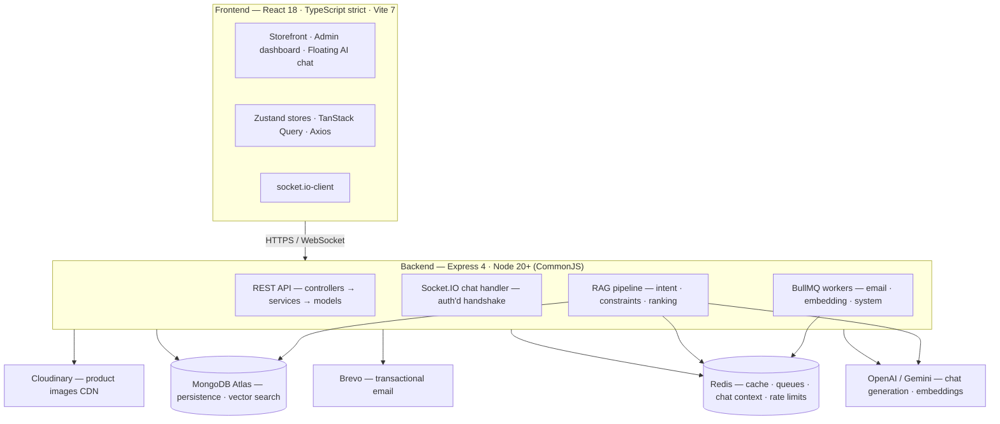

# Smart AI

> Full-stack AI e-commerce platform — React storefront, Express API, and a real-time RAG shopping assistant.


Smart AI is an e-commerce platform that pairs a complete storefront and admin dashboard with a floating AI shopping assistant. The assistant answers natural-language product queries (including multi-turn follow-ups) through a retrieval-augmented (RAG) pipeline — intent classification, MongoDB Atlas vector + text search, constraint parsing, and preference ranking — with answers streamed to the browser over Socket.IO. The React frontend deploys to Vercel (or Docker + nginx) and the Express backend to Render (or Docker), backed by MongoDB Atlas and Redis.

The platform is Vietnamese-language: user-facing store and assistant messages are written in Vietnamese, and the assistant is built and tested against Vietnamese shopping queries.

## Highlights

- **RAG shopping assistant** — query pipeline over MongoDB Atlas `$vectorSearch` with a stacked text/latest-products fallback, rule-based constraint parsing (price, brand, in-stock), soft-preference ranking, all tied to OpenAI `gpt-4o` (primary) with Gemini `gemini-2.0-flash` and a deterministic fallback.
- **Reliable real-time chat UX** — answers streamed to the browser in real time (small deltas over Socket.IO) with **message correlation + duplicate protection**, **user-initiated stop generation**, **Retry / Regenerate**, and **conversation history restore after reload**.
- **Semantic product search** — `gemini-embedding-001` embeddings (1536-dim) maintained by a content-hash-deduplicated BullMQ pipeline, queried via Atlas `$vectorSearch` with `$text` ranking fallback.
- **Secure identity** — JWT access/refresh flows, Google OAuth, email verification (hashed, one-time tokens), account lockout, Redis-backed login IP rate limiting (atomic Lua script), and a JWT-gated chat socket.
- **Reliable under failures** — graceful shutdown sequence, liveness/health/readiness endpoints, Redis auto-reconnect with an explicit fail-open/fail-closed policy map, idempotent checkout, and a bounded single-retry for timed-out GET requests (cold-start hardening).
- **Quality rail** — **3,338 automated tests** (backend 88 suites / 2,887 tests, frontend 44 files / 451 tests) plus an offline, deterministic AI evaluation harness; CI enforces type-check, lint, tests, and a production build on every push/PR.

## Architecture


```mermaid
flowchart TB
    subgraph FE["Frontend — React 18 · TypeScript strict · Vite 7"]
        UI["Storefront · Admin dashboard · Floating AI chat"]
        STATE["Zustand stores · TanStack Query · Axios"]
        SOCK["socket.io-client"]
    end

    subgraph BE["Backend — Express 4 · Node 20+ (CommonJS)"]
        REST["REST API — controllers → services → models"]
        WS["Socket.IO chat handler — auth'd handshake"]
        RAG["RAG pipeline — intent · constraints · ranking"]
        QUEUES["BullMQ workers — email · embedding · system"]
    end

    FE -- "HTTPS / WebSocket" --> BE

    BE --> MONGO[(MongoDB Atlas — persistence · vector search)]
    BE --> REDIS[(Redis — cache · queues · chat context · rate limits)]
    BE --> CLD[Cloudinary — product images CDN]
    BE --> BRV[Brevo — transactional email]
    BE --> LLM[OpenAI / Gemini — chat generation · embeddings]

    QUEUES --> REDIS
    RAG --> MONGO
    RAG --> REDIS
    RAG --> LLM
```

### Component roles

| Component | Role |
|---|---|
| MongoDB Atlas | Persistence + `$vectorSearch` (1536-dim `embedding_vector` index) |
| Redis | Product-query cache, BullMQ queues, chat context, login rate limiting |
| Cloudinary | Product image CDN (secure HTTPS, validated uploads) |
| Brevo | Transactional email (API only, no SMTP) — welcome, verification, password reset, unlock, order confirmation |
| OpenAI / Gemini | Chat generation and embeddings; OpenAI primary, Gemini fallback |

## AI Shopping Assistant (RAG)

The chat is a Socket.IO flow that runs this pipeline per product query:

1. **Intent classification** — `product_query` \| `small_talk` \| `complaint` \| `appointment` \| `store_query` \| `promotion_query` \| `personal_info` (OpenAI, Gemini fallback).
2. **Embed + retrieve** — query embedded with `gemini-embedding-001`, then Atlas `$vectorSearch`; on failure falls back to weighted `$text` search (name=10, brand=8, description=5, specs=6), then to latest in-stock products.
3. **Constrain** — rule-based parsing of the natural-language request (price range, brands include/exclude, in-stock) applied deterministically so answers respect the ask.
4. **Rank** — soft preferences (camera, battery, performance, compact) order results.
5. **Respond** — `gpt-4o` (primary) or `gemini-2.0-flash` (fallback) generates the Vietnamese answer; a deterministic builder is the final fallback. The product path **streams deltas** (`aiResponseStart` / `aiResponseChunk` / `aiResponseComplete`); small-talk, complaint, and deterministic answers are delivered as one `aiResponse`.

Chat reliability engineering:

- **Duplicate-safe handling** — the client mints a `clientMessageId`; Redis-keyed dedup (`chat:message:user:<user>:<session>:<id>`) makes redelivered messages idempotent: the paid pipeline never re-runs, and a completed answer is **replayed, not regenerated**. A bounded local LRU covers Redis outages (per-process only).
- **Multi-turn context** — Redis-scoped per `{ user, session }` (30-min TTL, 20 turns), merged with follow-up detection; two users sharing a `sessionId` can never see each other's context.
- **Ownership isolation** — conversations are indexed by `{ userId, sessionId }`; `userId` is always read from the authenticated socket identity, never from the client payload.
- **Stop generation** — one `AbortController` per accepted request threads a cancel signal through intent → context → RAG → provider stream, so stopping prevents every later phase (no partial content persisted, dedup claim released for a clean retry).
- **Retry / Regenerate** — logical-turn vs generation-attempt identity: Retry reuses the turn, Regenerate mints a fresh attempt id and atomically replaces the old answer only after success.

The full event/ack contracts, ordering rules, and test coverage are documented in [`docs/CHAT_MESSAGE_CORRELATION.md`](./docs/CHAT_MESSAGE_CORRELATION.md).

## Engineering Practices

- **Layered modular monolith** — middlewares (cross-cutting) → controllers (HTTP only) → services (business logic) → models (schema only), CommonJS on Node ≥ 20. No microservices.
- **Centralized error handling** — `AppError` hierarchy, `asyncHandler`, global `errorHandler` + `notFoundHandler`, consistent error envelope, no stack traces in production. (A small documented set of legacy routes still uses the old envelope.)
- **Observability** — Pino structured logging with request-correlation IDs and redaction of tokens/passwords/credentials/query params (`utils/logger.js`, `utils/sanitizeUrl.js`).
- **Health checking** — `/health` (liveness, no deps), `/api/health` (MongoDB + Redis), `/api/health/ready` (readiness: MongoDB critical, Redis degraded → still 200), `/api/health/live`.
- **Background jobs** — BullMQ queues with concurrency control (email, embeddings, system ping); embeddings are content-hash deduplicated.
- **API documentation** — OpenAPI 3.1 spec (swagger-jsdoc) served at `/api-docs`, kept accurate by a route-accuracy test suite.

## Security

- JWT access/refresh tokens with separate secrets; email tokens are SHA-256 hashed, single-use, and expire.
- Google OAuth via Google Identity Services; account lockout after 5 failed attempts (15-min window).
- **Rate limiting** — Redis-backed login limiter (20 attempts / 15 min per IP) using one atomic Lua script, plus express-rate-limit throttles on auth-session, email-action, resend-verification, token-action, and semantic-search endpoints.
- **Security headers** — Helmet `v8` with a custom CSP (production: strict `'self'` + Google, HSTS, `frame-ancestors`, `no-referrer`), applied before body parsers.
- **Socket auth** — chat connections must pass a JWT handshake (`io.use(...)`); query-string tokens and refresh tokens are rejected; four stable auth error codes.
- **Upload hardening** — Cloudinary images via signed server-side uploads; base64/URL validation rejects HTTP, `javascript:`/`blob:`/`file:`, localhost, and private IPs in production.
- **Secret hygiene** — no secrets in code; env-injected; `VITE_*` (public bundle) never carries backend secrets.

See [`SECURITY.md`](./SECURITY.md) for the full policy and known limitations.

## Reliability & Failure Handling

- **Graceful shutdown** — on SIGTERM/SIGINT: BullMQ workers/queues → Socket.IO (broadcasts `serverShutdown`) → HTTP server → Redis → MongoDB → log flush → exit.
- **Redis resilience** — auto-reconnect with exponential backoff (`min(500 × 2ⁿ, 30000)ms`, infinite), disabled during shutdown. Every Redis-dependent path has an explicit policy:

| Path | Policy |
|---|---|
| Product-query cache | Fail-open (uncached) |
| Login rate limiting | Fail-open (never blocks legit users on Redis loss) |
| Email resend throttle | Fail-closed (blocks spam on Redis loss) |
| Chat dedup | Local bounded LRU fallback (per-process) |
| Data persistence | MongoDB is always the source of truth |

- **Cold-start hardening** — the axios client retries a timed-out `GET` exactly once (`ECONNABORTED` with no HTTP response, GET-only, never a user abort and never the `/auth/refresh` call), bounding first-load failures during deploy cold starts.
- **Idempotent checkout** — client UUID key + request fingerprint prevents double-charges.

## Testing & CI/CD

> Test totals are a current snapshot verified on the main branch.

| Suite | Runner | Count |
|---|---|---|
| Backend | Jest 30 + Supertest 7, `--runInBand` | **88 suites / 2,887 tests** |
| Frontend | Vitest 4 + @testing-library/react 16 + jsdom | **44 files / 451 tests** |
| AI evaluation | Offline deterministic harness (`npm run evaluate:chatbot`) | **40 mocked scenarios** |

- Backend tests mock every external dependency (MongoDB, Redis, Cloudinary, Brevo, AI providers); Socket.IO suites run a real in-memory HTTP + socket server.
- The offline evaluation measures constraint accuracy, ranking (MRR), multi-turn context retention, and fallback reliability against curated fixtures — it is deterministic and CI-usable, and honestly documents that it is **not** live chatbot accuracy or production latency.
- **CI** (`.github/workflows/ci.yml`) — backend `npm test -- --runInBand`; frontend `npx tsc -b`, `npm run lint`, `npm test -- --no-file-parallelism`, `npm run build`. Plus Docker build validation for both images.
- **CD** (`.github/workflows/deploy-frontend.yml`) — auto-deploys the frontend to Vercel on `main`.
- Also run: `git diff --check` for whitespace errors.

## Getting Started

Prerequisites: Node ≥ 20, npm ≥ 9, and for the AI features: MongoDB Atlas (`$vectorSearch`), a Redis instance, and API keys for OpenAI/Gemini/Brevo/Cloudinary/Google OAuth.

### Docker (easiest)

```bash
cd Smart_AI_backend
cp .env.docker.example .env.docker   # add your API keys
cd ..
docker compose up --build
# Frontend: http://localhost:3000 · Backend: http://localhost:5000
# MongoDB: localhost:27017 · Redis: localhost:6379
```

*SPA note:* the Docker frontend is built with build-time `VITE_*` args, so env changes require a rebuild.

### Manual

```bash
# Backend (port 5000)
cd Smart_AI_backend
npm install
cp .env.example .env                 # fill in your keys (key vars below)
npm run dev

# Frontend (port 5173)
cd Smart_AI_frontend
npm install
cp .env.example .env
npm run dev
```

### Key environment variables

| Variable | Where | Purpose |
|---|---|---|
| `MONGO_CONNECTION_STRING` | backend | MongoDB URI (Atlas for `$vectorSearch`) |
| `REDIS_URL` | backend | Redis connection |
| `JWT_SECRET` / `JWT_REFRESH_SECRET` | backend | Token signing secrets (must differ) |
| `OPENAI_API_KEY` / `GEMINI_API_KEY` | backend | Chat generation + embeddings |
| `CLOUDINARY_*` | backend | Product image upload |
| `BREVO_API_KEY`, `BREVO_FROM_EMAIL`, `BREVO_FROM_NAME` | backend | Transactional email |
| `GOOGLE_CLIENT_ID` / `GOOGLE_CLIENT_SECRET` | backend | Google OAuth |
| `FRONTEND_URL` | backend | CORS + Socket.IO origin |
| `VITE_API_BASE_URL` | frontend | Backend API base URL (absolute, must not match the frontend origin) |

The full table (including optional rate-limit/queue tuning) is in the package READMEs and `docs/DEPLOYMENT.md`.

## Repository Map

```
Smart_AI_backend/      Express API, services, models, middlewares, BullMQ jobs
Smart_AI_frontend/     React SPA — feature modules, stores, services, AI chat UI
docs/                  Architecture, ERD, API overview, testing, roadmap, audits
evaluation/chatbot/    Offline deterministic AI evaluation harness
scripts/               Data migrations + API benchmarks (backend)
.github/workflows/     CI (tests/type-check/lint/build) + Vercel CD
```

## Key Engineering Decisions

- **Modular monolith, not microservices** — one deployable backend with clear seams; no distributed complexity that isn't yet warranted.
- **Socket.IO for chat** — a single authenticated connection carries streaming, dedup, stop, retry/regenerate, and typing state; history is a separate read-only REST layer that reuses the JWT/refresh flow.
- **Client-generated correlation ids** — `clientMessageId` at the edge gives duplicate-safe/idempotent message handling without server-side queues.
- **Retrieval before generation** — constraints and ranking are deterministic rules; the LLM only writes the final answer. Cheaper, faster, and testable offline.
- **Provider fallback chain** — OpenAI → Gemini → deterministic, with *no fallback after the first byte* so a stream never changes mid-way.
- **Honest evaluation** — an offline, mocked, deterministic eval harness gates AI regressions in CI; its limitations (no live accuracy/latency) are documented explicitly.
- **Documented trade-offs** — e.g., tokens live in `localStorage` (XSS exposure) pending an `httpOnly` cookie strategy; two error envelopes linger on legacy routes. See `docs/PROJECT_CONTEXT.md` and `docs/ROADMAP.md`.

## Demo

A guided walkthrough covering the storefront search, the AI chat (streaming, stop, retry/regenerate, history restore), auth/email flows, and the admin dashboard is in [`docs/PORTFOLIO_NOTES.md`](./docs/PORTFOLIO_NOTES.md).

## Documentation

| File | Contents |
|------|----------|
| [`docs/PORTFOLIO_NOTES.md`](./docs/PORTFOLIO_NOTES.md) | Executive summary, CV bullets, interview talking points, demo flow |
| [`docs/ARCHITECTURE.md`](./docs/ARCHITECTURE.md) | Deep-dive: request lifecycle, error handling, socket auth, AI pipeline |
| [`docs/CHAT_MESSAGE_CORRELATION.md`](./docs/CHAT_MESSAGE_CORRELATION.md) | Chat contracts: correlation, streaming, stop, retry/regenerate, history |
| [`docs/ERD.md`](./docs/ERD.md) | Full database schema, relationships, indexes |
| [`docs/API_OVERVIEW.md`](./docs/API_OVERVIEW.md) | Endpoint groups, auth, Swagger UI |
| [`docs/TESTING.md`](./docs/TESTING.md) | Test suites, mocking strategy, CI, pre-merge checklist |
| [`docs/DEPLOYMENT.md`](./docs/DEPLOYMENT.md) | Render/Vercel/Docker setup, env tables, rollback checklist |
| [`docs/ROADMAP.md`](./docs/ROADMAP.md) | Completed items, next priorities, technical debt |
| [`docs/CHANGELOG.md`](./docs/CHANGELOG.md) | Keep-a-Changelog history |
| [`SECURITY.md`](./SECURITY.md) | Security policy, secrets, hardening, known limitations |
| [`CONTRIBUTING.md`](./CONTRIBUTING.md) | Branch strategy, PR checklist, doc policy |

## License

Distributed under the MIT License.