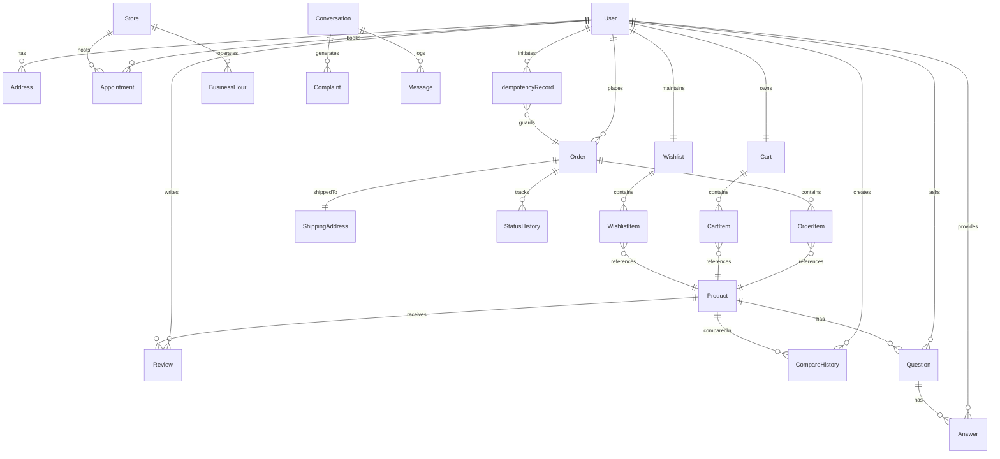
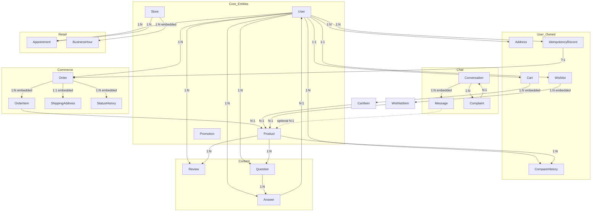

# Database Entity-Relationship Diagram (ERD)

> Last updated: 2026-07-29

## 1. High-Level Database Overview

Smart_AI uses **MongoDB 7** via **Mongoose 8** as its primary database. The database holds **16 collections** covering users, products, orders, inventory, content (reviews, Q&A, chatbot conversations), store management, appointments, promotions, and idempotency.

MongoDB's document model is leveraged for:
- **Embedded subdocuments**: Order items, shipping address, status history, cart/wishlist items, store business hours, conversation messages.
- **Flexible schema**: Product specifications stored as nested subdocuments (not separate tables).
- **Vector search**: 1536-dimensional embedding vectors on products for AI-powered semantic search.
- **Geospatial queries**: 2dsphere index on stores for proximity search.
- **Text search**: Weighted text indexes on products, stores, conversations, and complaints.
- **TTL indexes**: Idempotency records auto-expire via MongoDB TTL.

## 2. Collection List

| # | Collection | Mongoose Model | Description | Documents |
|---|-----------|---------------|-------------|-----------|
| 1 | `users` | User | Registered users (password + Google OAuth) | Root entity |
| 2 | `products` | Product | Product catalog with nested specs and AI embeddings | Root entity |
| 3 | `orders` | Order | Customer orders with embedded items, shipping, status history | Dependent |
| 4 | `carts` | Cart | Per-user shopping cart with embedded items | Dependent |
| 5 | `reviews` | Review | Product reviews with moderation status | Dependent |
| 6 | `addresses` | Address | Saved shipping addresses per user | Dependent |
| 7 | `promotions` | Promotion | Discount codes with usage limits and date ranges | Root entity |
| 8 | `wishlists` | Wishlist | Per-user wishlist with embedded items | Dependent |
| 9 | `stores` | Store | Physical store locations with hours and geolocation | Root entity |
| 10 | `complaints` | Complaint | Customer complaint tickets with priority and resolution tracking | Dependent |
| 11 | `conversations` | Conversation | Chatbot conversation history with embedded messages | Dependent |
| 12 | `comparehistories` | CompareHistory | Product comparison history (2-4 products per entry) | Dependent |
| 13 | `appointments` | Appointment | In-store appointment bookings (registered + guest) | Dependent |
| 14 | `questions` | Question | Product Q&A with upvoting | Dependent |
| 15 | `answers` | Answer | Answers to product questions (human + AI-suggested) | Dependent |
| 16 | `idempotencyrecords` | IdempotencyRecord | Checkout idempotency keys with TTL expiry | Dependent |

## 3. Relationship Table

### Entity-Relationship Arrow Diagram

```
User ──1:1──> Cart
User ──1:1──> Wishlist
User ──1:N──> Order
User ──1:N──> Review
User ──1:N──> Address
User ──1:N──> CompareHistory
User ──1:N──> Appointment
User ──1:N──> Question
User ──1:N──> Answer
User ──1:N──> IdempotencyRecord

Product ──1:N──> Review
Product ──1:N──> Question
Product ──1:N──> CompareHistory    (via products[])
Product ──1:N──> OrderItem         (via Order.items[].product)
Product ──1:N──> CartItem          (via Cart.items[].product)
Product ──1:N──> WishlistItem      (via Wishlist.items[].product)
Product ──1:N──> Conversation.ref  (via messages[].metadata.retrievedProducts[].productId)

Order ──1:N──> OrderItem           (embedded)
Order ──1:1──> ShippingAddress     (embedded)
Order ──1:N──> StatusHistory       (embedded)
Order ──?:1──> IdempotencyRecord

Store ──1:N──> Appointment

Conversation ──1:N──> Complaint
Conversation ──1:N──> Message       (embedded)

Question ──1:N──> Answer
Question ──N:1──> Product
Question ──N:1──> User

Answer ──N:1──> Question
Answer ──N:1──> User

Cart ──1:N──> CartItem             (embedded)
Wishlist ──1:N──> WishlistItem      (embedded)
Store ──1:N──> BusinessHour        (embedded, 7 days)

IdempotencyRecord ──N:1──> User
IdempotencyRecord ──?:1──> Order

User ──N:N──> Product               (via Review, Question, Wishlist, Cart, Order, CompareHistory)
```

## 4. Mermaid ER Diagram



## 5. Mermaid Relationship Graph



## 6. Relationship Explanations

### 6.1 One-to-One

| Parent | Child | Type | Mechanism | Notes |
|--------|-------|------|-----------|-------|
| **User** | **Cart** | Referenced (1:1) | `Cart.user` (unique, ref User) | One shopping cart per registered user |
| **User** | **Wishlist** | Referenced (1:1) | `Wishlist.user` (unique, ref User) | One wishlist per registered user |
| **Order** | **ShippingAddress** | Embedded (1:1) | `Order.shippingAddress` (embedded subdoc) | Copy of shipping address at time of order |
| **Order** | **IdempotencyRecord** | Referenced (?:1) | `IdempotencyRecord.order` (nullable, ref Order) | Not all records have an order (failed/cancelled) |

### 6.2 One-to-Many

| Parent | Child | Type | Mechanism | Notes |
|--------|-------|------|-----------|-------|
| **User** | **Order** | Referenced | `Order.user` → User | User can place many orders |
| **User** | **Review** | Referenced | `Review.user` → User | User can write many reviews |
| **User** | **Address** | Referenced | `Address.user` → User | User can save many addresses |
| **User** | **CompareHistory** | Referenced | `CompareHistory.user` → User | User can have many comparison sessions |
| **User** | **Appointment** | Referenced | `Appointment.user` → User (nullable) | Both registered and guest appointments |
| **User** | **Question** | Referenced | `Question.user` → User | User can ask many questions |
| **User** | **Answer** | Referenced | `Answer.user` → User | User can write many answers |
| **User** | **IdempotencyRecord** | Referenced | `IdempotencyRecord.user` → User | Many idempotency keys per user |
| **Product** | **Review** | Referenced | `Review.product` → Product | Product can have many reviews |
| **Product** | **Question** | Referenced | `Question.product` → Product | Product can have many questions |
| **Product** | **CompareHistory** | Referenced | `CompareHistory.products[]` → Product (array) | Product appears in many comparisons |
| **Product** | **OrderItem** | Embedded (indirect) | `Order.items[].product` → Product | Product appears in many order items |
| **Product** | **CartItem** | Embedded (indirect) | `Cart.items[].product` → Product | Product appears in many cart items |
| **Product** | **WishlistItem** | Embedded (indirect) | `Wishlist.items[].product` → Product | Product appears in many wishlists |
| **Product** | **Message.metadata** | Embedded (indirect) | `Conversation.messages[].metadata.retrievedProducts[].productId` → Product | Product referenced in chatbot context |
| **Order** | **OrderItem** | Embedded (1:N) | `Order.items[]` (array of subdocs) | Line items of an order |
| **Order** | **StatusHistory** | Embedded (1:N) | `Order.statusHistory[]` (array of subdocs) | Order status change log |
| **Cart** | **CartItem** | Embedded (1:N) | `Cart.items[]` (array of subdocs) | Items in the shopping cart |
| **Wishlist** | **WishlistItem** | Embedded (1:N) | `Wishlist.items[]` (array of subdocs) | Saved products |
| **Store** | **Appointment** | Referenced | `Appointment.store` → Store | Store hosts many appointments |
| **Store** | **BusinessHour** | Embedded (1:N) | `Store.businessHours.{day}` (7 named subdocs) | Operating hours per day |
| **Conversation** | **Complaint** | Referenced | `Complaint.conversationId` → Conversation | Conversation may generate complaints |
| **Conversation** | **Message** | Embedded (1:N) | `Conversation.messages[]` (array of subdocs) | Chat message history |
| **Question** | **Answer** | Referenced | `Answer.question` → Question | Question can have multiple answers |
| **Complaint** | — | Referenced | `Complaint.conversationId` → Conversation | N:1 back to Conversation |

### 6.3 Many-to-Many

All many-to-many relationships are implicit through junction collections or embedded arrays:

| Entity A | Entity B | Junction | Mechanism |
|----------|----------|----------|-----------|
| **User** | **Product** | Review | `Review` references both User and Product |
| **User** | **Product** | Question | `Question` references both User and Product |
| **User** | **Product** | CompareHistory | `CompareHistory` references User and Product[] |
| **Product** | **Conversation** | Message.metadata.retrievedProducts[] | Embedded array of product refs in message metadata |

### 6.4 Referenced vs. Embedded

| Strategy | Collections | Rationale |
|----------|-------------|-----------|
| **Referenced** | Majority of collections | Normalized, independent lifecycle, supports indexes and queries |
| **Embedded** | OrderItem, CartItem, WishlistItem | Tightly coupled to parent, queried together, no independent lifecycle |
| **Embedded** | ShippingAddress, StatusHistory | Snapshot data (point-in-time), immutable after creation |
| **Embedded** | BusinessHour | Fixed set (7 days), always read with store |
| **Embedded** | Message | Array limited by application logic (max 20 turns in context), always read with Conversation |

## 7. Index Documentation

### users
| Index | Key | Unique | Sparse | Notes |
|-------|-----|--------|--------|-------|
| `email` | `email: 1` | Yes | No | Field-level unique constraint |
| `googleId` | `googleId: 1` | Yes | Yes | Allows null with sparse |

### products
| Index | Key(s) | Unique | Notes |
|-------|--------|--------|-------|
| Text | `name`, `brand`, `description`, `specs.processor.chipset` | — | Weighted (10, 8, 5, 6) |
| `brand` | `brand: 1` | — | Single-field |
| `price` | `price: 1` | — | Single-field |
| `isActive` | `isActive: 1` | — | Filter active products |
| `inStock` | `inStock: 1` | — | Inventory queries |
| `createdAt` | `createdAt: -1` | — | Newest products |
| `brand_price` | `brand: 1, price: 1` | — | Compound |
| `active_stock` | `isActive: 1, inStock: 1` | — | Compound filter |
| `slug` | `slug: 1` | Yes (sparse) | URL-friendly identifier |

### orders
| Index | Key(s) | Unique | Notes |
|-------|--------|--------|-------|
| `user` | `user: 1` | — | User's orders |
| `status` | `status: 1` | — | Filter by status |
| `createdAt` | `createdAt: -1` | — | Recent orders |
| `user_createdAt` | `user: 1, createdAt: -1` | — | User's recent orders |
| `status_createdAt` | `status: 1, createdAt: -1` | — | Admin filtering |
| `orderNumber` | `orderNumber: 1` | Yes | Field-level unique |

### reviews
| Index | Key(s) | Unique | Notes |
|-------|--------|--------|-------|
| `user_product` | `user: 1, product: 1` | Yes | One review per user per product |
| `product_status` | `product: 1, status: 1` | — | Approved reviews by product |
| `status_createdAt` | `status: 1, createdAt: -1` | — | Admin moderation queue |

### addresses
| Index | Key(s) | Unique | Notes |
|-------|--------|--------|-------|
| `user` | `user: 1` | — | User's saved addresses |
| `user_default` | `user: 1, isDefault: 1` | — | Filter default address |

### promotions
| Index | Key(s) | Unique | Notes |
|-------|--------|--------|-------|
| `code` | `code: 1` | Yes | Field-level unique |
| `active_dates` | `isActive: 1, startDate: 1, endDate: 1` | — | Active promotions |
| `createdAt` | `createdAt: -1` | — | Recent promotions |

### wishlists
| Index | Key(s) | Unique | Notes |
|-------|--------|--------|-------|
| `user` | `user: 1` | Yes | Field-level unique (one per user) |
| `items.product` | `'items.product': 1` | — | Check product in wishlists |

### stores
| Index | Key(s) | Unique | Notes |
|-------|--------|--------|-------|
| `location` | `location: '2dsphere'` | — | Geospatial for proximity search |
| `isActive` | `isActive: 1` | — | Active stores |
| Text | `name`, `address.fullAddress` | — | Store text search |

### complaints
| Index | Key(s) | Unique | Notes |
|-------|--------|--------|-------|
| `sessionId` | `sessionId: 1` | — | Lookup by chatbot session |
| `conversationId` | `conversationId: 1` | — | Link to conversation |
| `status` | `status: 1` | — | Filter by status |
| `priority` | `priority: 1` | — | Filter by priority |
| `createdAt` | `createdAt: -1` | — | Recent complaints |
| `resolvedAt` | `resolvedAt: -1` | — | Resolution tracking |
| `status_priority` | `status: 1, priority: 1` | — | Compound admin filter |
| `status_createdAt` | `status: 1, createdAt: -1` | — | Admin queue |
| `assignedTo_status` | `assignedTo: 1, status: 1` | — | Assignment tracking |
| Text | `complaintSummary`, `detailedDescription`, `resolutionNotes` | — | Weighted (10, 5, 3) |

### conversations
| Index | Key(s) | Unique | Notes |
|-------|--------|--------|-------|
| `sessionId` | `sessionId: 1` | Yes | Field-level unique |
| `lastMessageAt` | `lastMessageAt: -1` | — | Active conversations |
| `createdAt` | `createdAt: -1` | — | Recent conversations |
| `status` | `status: 1` | — | Filter by status |
| `status_lastMessageAt` | `status: 1, lastMessageAt: -1` | — | Compound |
| `messageCount_createdAt` | `messageCount: 1, createdAt: -1` | — | Engagement analysis |
| Text | `messages.content` | — | Search message content |

### comparehistories
| Index | Key(s) | Unique | Notes |
|-------|--------|--------|-------|
| `user_createdAt` | `user: 1, createdAt: -1` | — | User's comparison history |

### appointments
| Index | Key(s) | Unique | Notes |
|-------|--------|--------|-------|
| `store_date` | `store: 1, date: 1` | — | Store schedule |
| `user_date` | `user: 1, date: -1` | — | User's appointments |
| `status` | `status: 1` | — | Filter by status |
| `date_status` | `date: 1, status: 1` | — | Date-based scheduling |

### questions
| Index | Key(s) | Unique | Notes |
|-------|--------|--------|-------|
| `product_status` | `product: 1, status: 1` | — | Visible questions per product |
| `product_upvotes` | `product: 1, upvoteCount: -1` | — | Popular questions |
| `user` | `user: 1` | — | User's questions |
| `status_createdAt` | `status: 1, createdAt: -1` | — | Admin moderation |

### answers
| Index | Key(s) | Unique | Notes |
|-------|--------|--------|-------|
| `question_createdAt` | `question: 1, createdAt: 1` | — | Answers per question |
| `isAISuggestion` | `isAISuggestion: 1` | — | AI-suggested answers filter |

### idempotencyrecords
| Index | Key(s) | Unique | TTL | Notes |
|-------|--------|--------|-----|-------|
| `user_key` | `user: 1, idempotencyKey: 1` | Yes | — | Prevent duplicate checkouts |
| `expiresAt` | `expiresAt: 1` | — | `expireAfterSeconds: 0` | Auto-cleanup expired records |
| `status_processingExpiresAt` | `status: 1, processingExpiresAt: 1` | — | — | Stale processing detection |

## 8. Unique Constraints

| Collection | Field(s) | Type | Purpose |
|-----------|----------|------|---------|
| users | `email` | Single-field | Unique email per account |
| users | `googleId` | Single-field (sparse) | One Google account link per user |
| products | `slug` | Single-field (sparse) | Unique URL-friendly identifier |
| orders | `orderNumber` | Single-field | Unique order reference (ORD-YYYYMMDD-XXX) |
| promotions | `code` | Single-field | Unique discount code |
| conversations | `sessionId` | Single-field | Unique chatbot session |
| carts | `user` | Single-field | One cart per user |
| wishlists | `user` | Single-field | One wishlist per user |
| reviews | `user` + `product` | Compound | One review per user per product |
| idempotencyrecords | `user` + `idempotencyKey` | Compound | One idempotency key per user |

## 9. Soft Delete Strategy

Smart_AI does **not** implement a formal soft-delete pattern with `deletedAt` / `isDeleted` fields. Instead, three collections use an **active flag** pattern:

| Collection | Field | Default | Usage |
|-----------|-------|---------|-------|
| `products` | `isActive` | `true` | Products are deactivated (not deleted) when removed from catalog |
| `stores` | `isActive` | `true` | Stores are deactivated when closed |
| `promotions` | `isActive` | `true` | Promotions are deactivated when expired or disabled |

**Implications:**
- Queries for active entities must include `{ isActive: true }` (enforced by compound indexes).
- Deactivated records remain in the database for historical reference.
- No cascading soft delete — related reviews, questions, orders are not affected when a product is deactivated.
- The `embeddingStatus` field on products (`pending/processing/ready/failed`) acts as a processing state flag, not a delete marker.

**Recommendation:** If hard-delete is needed in the future (e.g., GDPR right to erasure), implement application-level cascade logic rather than database-level CASCADE (which MongoDB does not support).

## 10. Future Scaling Recommendations

### 10.1 Indexing
- **Covering queries**: Some compound indexes (e.g., `{ status: 1, createdAt: -1 }`) may benefit from including additional fields via `{ ... }` with `.select()` restrictions.
- **Partial indexes**: Consider partial indexes for `{ isActive: true }` to reduce index size.
- **Text search overlap**: Product and complaint text indexes have overlapping field weights — consider consolidating or using Atlas Search for production-scale full-text search.

### 10.2 Schema Evolution
- **Timezone-aware dates**: Appointment `date` field stores a Date but timezone is implicit — consider storing as UTC with an explicit timezone offset for multi-region support.
- **Order snapshot growth**: `Order.statusHistory[]` grows unboundedly — consider a cap at 50 entries or archiving to a separate collection.
- **Conversation message limits**: `Conversation.messages[]` is capped by application logic (20 turns) but should also enforce a schema-level validator.
- **Vector search scalability**: `embedding_vector` (1536 floats) increases document size significantly — consider a separate `product_embeddings` collection if performance degrades.

### 10.3 Sharding Strategy
If the dataset grows beyond a single node:
- **User-centric shard key**: `{ userId: 1 }` for User, Order, Cart, Wishlist, Address, Review, CompareHistory, Appointment.
- **Product-centric shard key**: `{ productId: 1 }` for Product, Review, Question.
- **Time-based shard key**: `{ createdAt: 1 }` for Conversation, Complaint, IdempotencyRecord.

### 10.4 Archival
- **IdempotencyRecords**: Already auto-expire via TTL (default 7 days).
- **Old conversations**: Consider moving conversations older than 90 days to a cold storage collection.
- **Historical orders**: Keep in main collection for customer access, but consider archiving order items > 2 years to reduce working set size.

### 10.5 Relationship Integrity
MongoDB does not enforce foreign key constraints at the database level. Consider:
- **Idempotency check**: Already implemented via `IdempotencyRecord` with unique compound key.
- **Orphan detection**: Background job to detect and clean up `Answer` records with no parent `Question`, `Review` with no parent `Product`, etc.
- **Cascading deletes**: Implement application-level cascade (e.g., delete Answers when a Question is deleted — partially done via `Answer.deleteByQuestion()`).

### 10.6 Embedding Over Threshold
- **OrderItem embedding**: At 15+ items per order, the embedded array increases document size — consider capping items or splitting large orders.
- **Message array**: Already capped at 20 by application logic; if increased, consider moving to a separate `messages` collection.
